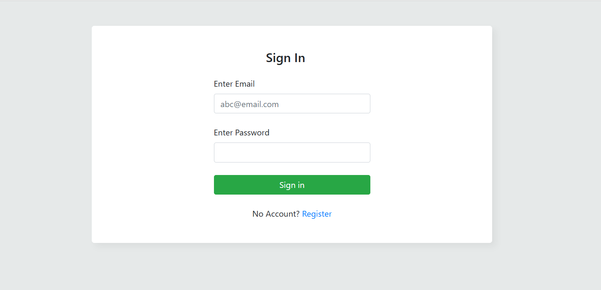
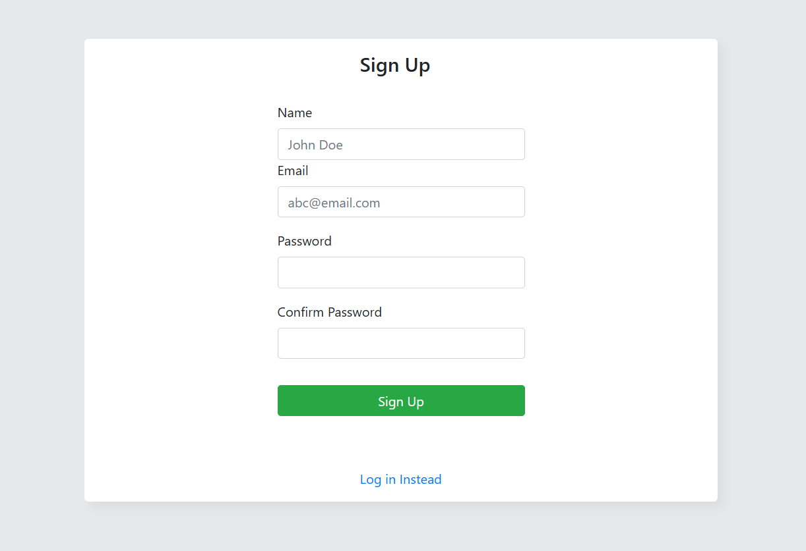
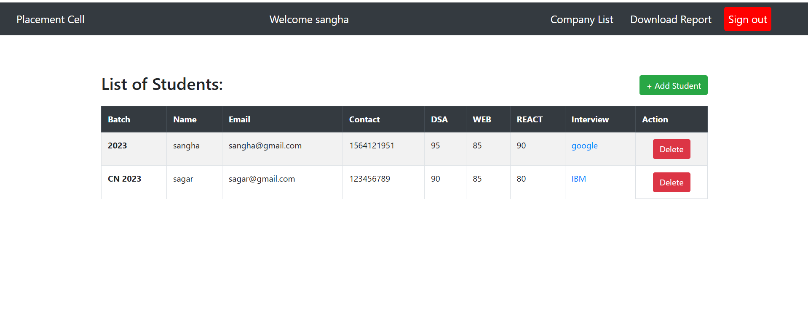
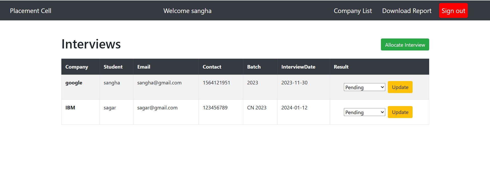

# 📊 Placement Cell

A full-stack web application designed for managing placement activities in a college or organization. This system helps placement cells to maintain student records, schedule interviews, track results, and generate reports.

---

## 📌 Features

- Employee **Sign Up / Sign In** functionality with secure authentication using **Passport.js**.
- Add new student profiles and maintain an organized list of students.
- Schedule interviews with multiple companies and update their result status.
- Generate and download **CSV reports** of student data.
- Clean and user-friendly interface built with **EJS** templating.
- Follows **MVC architecture** for better code management and scalability.

---

## 🛠️ Tech Stack

- **Backend:** Node.js, Express.js  
- **Database:** MongoDB  
- **Authentication:** Passport.js  
- **Templating Engine:** EJS  

## 🧰 Tools Used

- Visual Studio Code  
- MongoDB Compass  

---

## 📸 Screenshots

